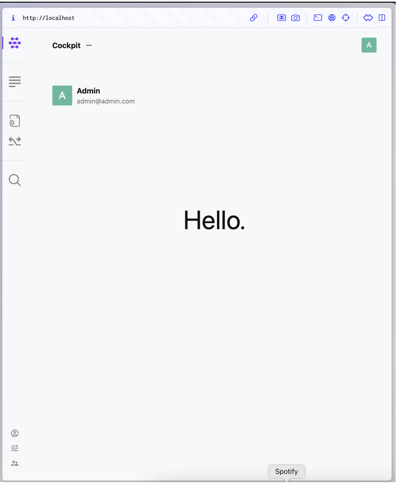
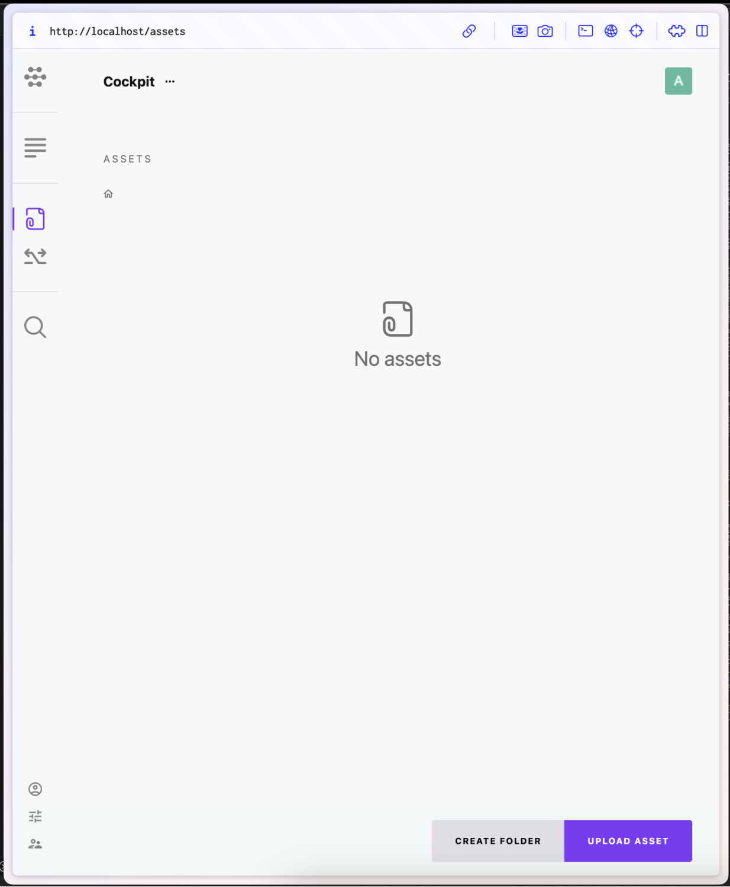
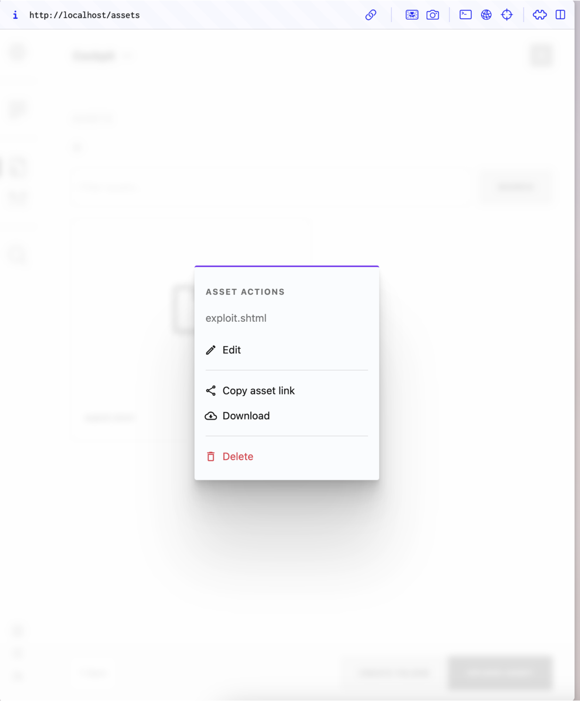
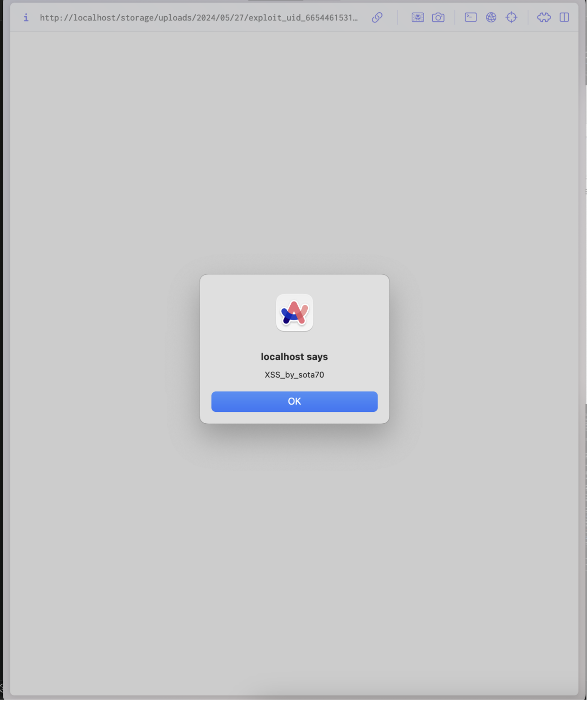

# CVE-2023-41564脆弱性概要

CVE-2023-41564<sup>1</sup>はCockpitというCMS(<= v2.6.3)に存在する蓄積型XSSの脆弱性です。
ファイルアップロード時に.shtml拡張子のHTMLファイルをアップロードすると、そのアップロードされたファイルを開いた瞬間にJavaScriptが実行されてしまうというものです。

1: https://nvd.nist.gov/vuln/detail/CVE-2023-41564

# 攻撃成立の流れ

まず初めに、脆弱性の報告者と思われる方が公開しているPoC<sup>2</sup>を基に攻撃手法を解説していきます。
まずファイルアップロード権限を持っているアカウントで、サイトにログインします。


そこで以下のようなshtmlファイルをアップロードします。
```html

```
アップロードされたファイル(Asset)のURLをコピーします。

コピーしたリンクにアクセスすると、上記のHTMLに記述されたスクリプトが作動します。


2: https://github.com/LongHair00/Mitre_opensource_report/blob/main/CockpitCMS-StoredXSS.md

# 具体的な発生経緯

ここからは私がさらに掘り下げて調査した結果を解説します。
Assetsのアップロード処理は/assets/uploadパスに対するPOSTリクエストが起点となっています。
アップロードリクエストの処理はmodules/Assets/bootstrap.phpの51行目<sup>3</sup>に定義されています。
以下にコードを示します。
```php
// assets api
$this->module('assets')->extend([

    // 省略
    'upload' => function(string|array $param = 'files', array $meta = [], bool $isUpload = true) {

        $files = [];

        if (is_string($param) && isset($this->app->request->files[$param])) {
            $files = $this->app->request->files[$param];
        } elseif (is_array($param) && isset($param['name'], $param['error'], $param['tmp_name'])) {
            $files = $param;
        }

        $finfo      = finfo_open(FILEINFO_MIME_TYPE);
        $uploaded  = [];
        $failed    = [];
        $_files     = [];
        $assets    = [];

        $allowed   = $this->app->retrieve('assets/allowed_uploads', '*');
        $allowed   = $allowed == '*' ? true : str_replace([' ', ','], ['', '|'], preg_quote(is_array($allowed) ? implode(',', $allowed) : $allowed));
        $max_size  = $this->app->retrieve('assets/max_upload_size', 0);

        $forbiddenExtension = ['bat', 'exe', 'sh', 'php', 'phar', 'phtml', 'phps', 'htm', 'html', 'xhtml', 'htaccess'];
        $forbiddenMime = [
            'application/x-httpd-php', 'application/x-php', 'text/x-php',
            'text/html', 'application/xhtml+xml'
        ];

        if (isset($files['name']) && is_array($files['name'])) {

            $cnt = count($files['name']);

            for ($i = 0; $i < $cnt; $i++) {

                $_file  = $this->app->path('#tmp:').'/'.$files['name'][$i];
                $_mime = $finfo->file($files['tmp_name'][$i]);
                $_isAllowed = $allowed === true ? true : preg_match("/\.({$allowed})$/i", $_file);
                $_sizeAllowed = $max_size ? filesize($files['tmp_name'][$i]) < $max_size : true;

                $extension = strtolower(pathinfo(parse_url($_file, PHP_URL_PATH), PATHINFO_EXTENSION));

                if (!$extension) {
                    $_isAllowed = false;
                }

                // prevent uploading php / html files
                if ($_isAllowed && (
                    in_array($extension, $forbiddenExtension) ||
                    in_array(strtolower($_mime), $forbiddenMime)
                )) {
                    $_isAllowed = false;
                }

                if (!$files['error'][$i] && $_isAllowed && $_sizeAllowed && ($isUpload ? move_uploaded_file($files['tmp_name'][$i], $_file) : rename($files['tmp_name'][$i], $_file))) {

                    $_files[]   = $_file;
                    $uploaded[] = $files['name'][$i];

                    if (\preg_match('/\.(svg|xml)$/i', $_file)) {
                        file_put_contents($_file, \SVGSanitizer::clean(\file_get_contents($_file)));
                    }

                } else {
                    $failed[] = $files['name'][$i];
                }
            }
        }

        if (count($_files)) {

            $assets = $this->add($_files, $meta, isset($meta['_id']));

            foreach ($_files as $file) {
                unlink($file);
            }
        }

        return ['uploaded' => $uploaded, 'failed' => $failed, 'assets' => $assets];
    },
    // 省略
]);
```
upload関数はAppクラスのregistry['modules']['assets']というAssetsモジュールの関数を格納するメンバ変数へと格納されています。
なので、upload関数を呼び出す際には$this->module('assets')->upload('file', $file);のように呼び出します。
ここで登録されたupload関数はAssetsクラス<sup>4</sup>が呼び出します。
```php
public function upload() {
    this->helper('session')->close();
    this->hasValidCsrfToken(true);
    if (!this->isAllowed('assets/upload')) {
        return $this->stop(['error' => 'Upload not allowed'], 401);
    }
    $meta = ['folder' => $this->param('folder', '')];
    return $this->module('assets')->upload('files', $meta);
}
```
registry['modules']['assets']に登録されたupload関数が呼び出されているのが分かると思います。
ここでbootstrap.phpで記述されているupload関数を見てみます。
ここでは$forbiddenExtension変数に禁止する拡張子を定義しています。
ですが、shtml拡張子が抜けています。
なので、ここが欠陥となり、shtmlファイルのアップロードが可能となっているのです。

3: https://github.com/Cockpit-HQ/Cockpit/blob/2.6.3/modules/Assets/bootstrap.php#L51
4: https://github.com/Cockpit-HQ/Cockpit/blob/2.6.3/modules/Assets/Controller/Assets.php#L140

# 対策

shtmlが許可されていないことが原因なので、forbiddenExtensionにshtmlを追加すれば対策可能です。
```php
$forbiddenExtension = ['bat', 'exe', 'sh', 'php', 'phar', 'phtml', 'phps', 'htm', 'html', 'xhtml', 'htaccess', 'shtml'];
```
